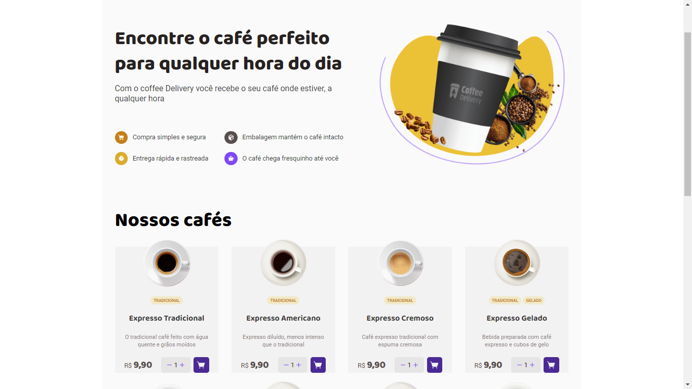
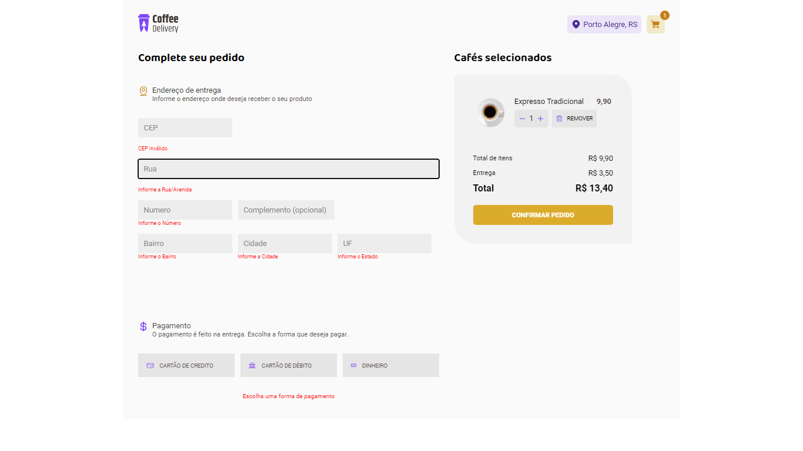
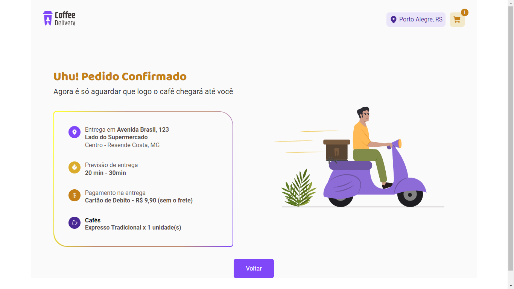

## Challenge 02 - Ignite 2022 - React JS - Coffee Delivery

This challenge is a coffee store where you can buy, fill the address, choose payment method and confirm the request.
A lot of concepts of React was used in this project, like hooks and components. The main one was Context. Since multiples components need the information about the request, Context was the better choice. The information was the list of produtcs (coffees in this case), quantity, images url, prices, address and payment method.

# Languagues used

* HTML
* CSS (Styled Components)
* javaScript
* TypeScript

# Explanation

The Application manage a shopping cart of a coffee shop. It must have the following features:
* List all products (coffees) available to buy.
* Add a certain quantity of item in the cart.
* Increase or remove the quantity of items in the cart.
* Have a form to use put his address.
* Show the total of items in the cart on the Header.
* Show the total value of the sum of all items, according with its quantity and price.

In addition, the aplication uses the following advanced features:

* **Context:** There are two contexts. One for the cart and other for the address/payment. Chose the context so I can use the information in multiple components and make the changes using reducers. By this way, the code becomes simples and easy to maintain.

* **react-hook-form:** This library helps us deal with form data. Used it to get the address and payment method of the user. To deal with validation, was used **Zod**

* **react-router-dom:** Library used to control/change the router in a easy way.

* **Zip Code api:** The application has a feature to retrieve the address from zip  code that the user will put on the form. This way, can auto complete the data that will be found from api.

* **localStorage:** LocalStorage is used to maintain the cart data. So it won't be lost the user refreshes the page.

* **Responsiveness:** To let the challenge completed, I included in the responsive design. So the application looks good on mobile and desktop.

# Pages
## Home Page

The Home Page is where all products is listed.

## Checkout Page

This pages shows a form with validation to the user, so he can put his address, payment methods and see his products. Can add or remove his products if he wants. If he goes to this page with no product in the cart, a button is shown to go back.

## Success Page

After his completion, a success page is shown with the request details. His address, payment methos, total and list of products is shown on the page.

# How can I use it?

### First
Check if you have the node and npm (comes with node) installed in your machine. To check, you must go to your terminal or command prompt and type:
> node -v
> npm -v

If shows the version, you are good to go. If not, go to https://nodejs.org/en/ and install the LTS version (it will install both node and npm).

### Second

If you don't have an IDE, install one of you preference. In my case, I used Visual Studio Code.

### Thrid

You clone the project. Use the commande line on your folder:
 > git clone https://github.com/Vinicius-PR/Challenge-02-Ignite-2022-coffe-delivery
 
 ### Forth
 
Open the folder using your IDE. Then, go to the terminal of your IDE and type the following command to install the dependencies: (or can go to the folder application using normal terminal and type the same command)
 > npm install
 
 ### Finally
 
Type the next command to see the result and click on the link that will appear on the terminal:
 > npm run dev
